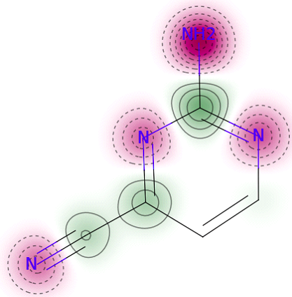
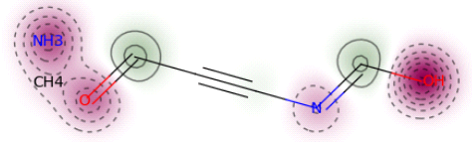

# Quantum GAN with Hybrid Generator
PennyLane and Pytorch implementation of QGAN-HG: Quantum generative models for small molecule drug discovery, based on MolGAN (https://arxiv.org/abs/1805.11973)  
This library refers to the following source code.
* [yongqyu/MolGAN-pytorch](https://github.com/yongqyu/MolGAN-pytorch)
* [nicola-decao/MolGAN](https://github.com/nicola-decao/MolGAN)
* [yunjey/StarGAN](https://github.com/yunjey/StarGAN)


For details see [Quantum Generative Models for Small Molecule Drug Discovery](https://arxiv.org/abs/2101.03438) by Junde Li, Rasit Topaloglu, and Swaroop Ghosh.


## Dependencies

* **python>=3.5**
* **pytorch>=0.4.1**: https://pytorch.org
* **rdkit**: https://www.rdkit.org
* **pennylane**
* **tensorflow==1.15**
* **frechetdist**

## Structure
* [data](https://github.com/jundeli/quantum-gan/data): should contain your datasets. If you run `download_dataset.sh` the script will download the dataset used for the paper (then you should run `data/sparse_molecular_dataset.py` to conver the dataset in a graph format used by MolGAN models).
* [models](https://github.com/jundeli/quantum-gan/models.py): Class for Models.

## Training
```
python main.py --quantum True --layer 2 --qubits 10 --complexity 'hr'
```
If you want to run classical MolGAN, please set quantum argument to False. But you can still train reduced models by setting complexity to 'hr'-highly reduced (around 2% of original generator papameters), 'mr'-moderately reduced (around 15%), or 'nr'-no reduce. Layer and qubits can adjust expressive power of variational quantum circuit.

```
python p2_qgan_hg.py
```
Run 'p2_qgan_hg'.py or 'p4_qgan_hg.py' for implementing patched quantum GAN with hybrid generator for 2 pathes and 4 patches, respectively.


## Demo
You can see generated small molecules with pretrined models which are included in qgan-hg/models. Quantum circuit parameters are shown in gen_weights.csv. Inference can be done on either PennyLane quantum simulator or real IBM quantum computers.

```
qgan-hg-demo.ipynb 
```
Below are some generated molecules:

<div style="color:#0000FF" align="center">
 
</div>

## Citation
```
[1] J. Li, R. Topaloglu, and S. Ghosh. Quantum Generative Models for 
Small Molecule Drug Discovery. arXiv preprint 2101.03438, 2021.
```


BibTeX format:
```
@ARTICLE{2021arXiv210103438L,
       author = {{Li}, Junde and {Topaloglu}, Rasit and {Ghosh}, Swaroop},
        title = "{Quantum Generative Models for Small Molecule Drug Discovery}",
      journal = {arXiv e-prints},
     keywords = {Computer Science - Emerging Technologies, Computer Science - Machine Learning, Quantum Physics},
         year = 2021,
        month = jan,
          eid = {arXiv:2101.03438},
        pages = {arXiv:2101.03438},
archivePrefix = {arXiv},
       eprint = {2101.03438},
 primaryClass = {cs.ET},
       adsurl = {https://ui.adsabs.harvard.edu/abs/2021arXiv210103438L},
      adsnote = {Provided by the SAO/NASA Astrophysics Data System}
}

```
